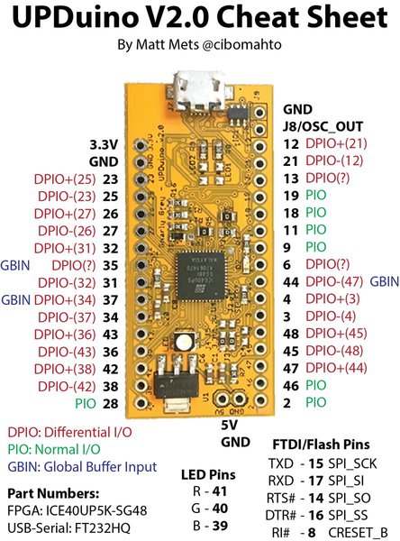

# prewish-blinky-5k
Same as prewish-blinky, but for the Upduino v2.0 instead of the iceStick.

I expect this to be largely identical to prewish-blinky. It should be the same except for pcf pin assignments, bits for clock dividers, global buffer and oscillator settings, etc. Platform-dependent stuff.

It ended up needing a little bit of a refactor into the "top," which supplies the system clock. The testbench takes the place of "top" and just creates a clock with always #1 thing.

As of 8/17/19, wired up and working!

## Building

With icestorm, nextpnr, yosys, etc. in place - see prewish-blinky - run the following from the project directory:

```
./build.sh
```

If the build works, use 

```
iceprog prewish5k.bin
```

to send it to the device.

## Wiring

**See pinout below**

```
Pin: Description

39   the_led, Upduino v2.0's built-in RGB LED green. Active low.
36   o_led0 - external LED for "alive" signaling/debugging. Active low. Requires current limiting resistor.
42   o_led1 - same
38   o_led2 - same
28   o_led3 - same
12   i_bit0 - DIP switch LSB (rightmost of 8). Active low. Pins pulled up internally so no ext pullups needed.
21   i_bit1
13   i_bit2
19   i_bit3
18   i_bit4
11   i_bit5
9    i_bit6
6    i_bit7 - msb-leftmost
4    momentary contact SPST normally-open active low. Pulled up internally, no external pullup needed.
```

----
### From [osresearch's up5k repository](https://github.com/osresearch/up5k):

Schematics for the upduino: https://github.com/gtjennings1/UPDuino_v2_0



Note that the [`upduino_v2.pcf`](images/upduino_v2.pcf) file (copied from osresearch's repo) disagrees with the serial port in the pinout and schematic.  The pins were determined through experimentation and seem to work (and the ones in the pinout do not).

### end from osresearch's up5k repo
----
